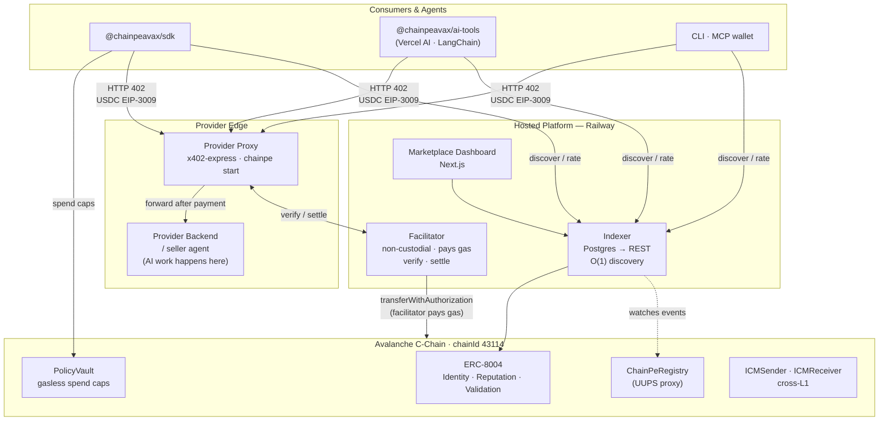
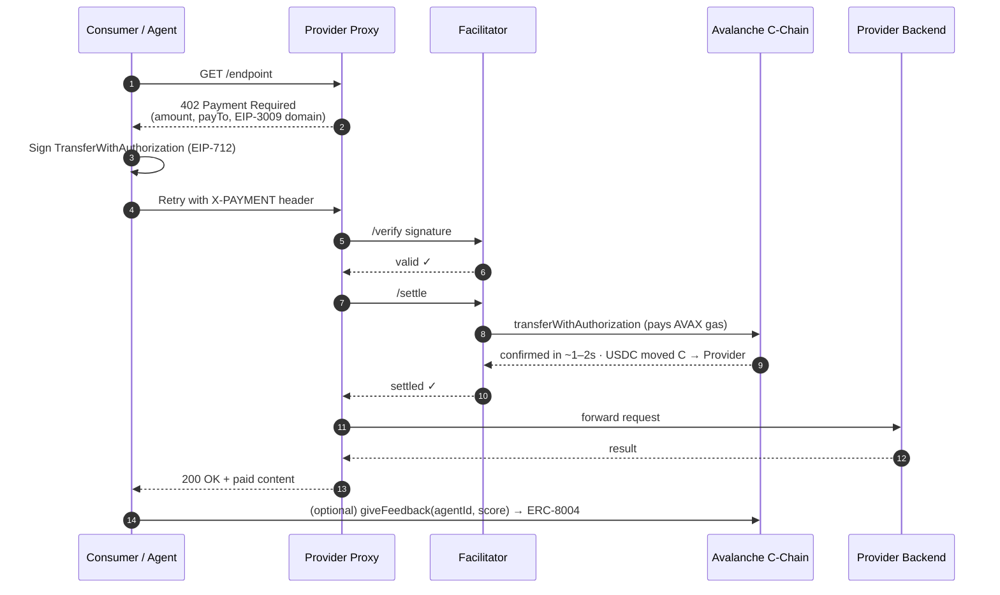

<div align="center">

# ChainPe

### Payment + reputation rails for the autonomous agent economy

**Live on Avalanche C-Chain Mainnet**

### Live link: **[chainpe.vercel.app](https://chainpe.vercel.app/)**

[](https://opensource.org/licenses/MIT)
[](https://snowtrace.io/address/0x2a589f1e4e3Cd0A3ee986cec5202aF3760E3170E)
[](#testing)
[](https://x402.org)
[](https://eips.ethereum.org/EIPS/eip-8004)

**[Marketplace](https://chainpe.vercel.app/)** ·
**[Indexer API](https://chainpe-indexer-production-f791.up.railway.app/services)** ·
**[Facilitator](https://chainpe-facilitator-production-000a.up.railway.app/health)** ·
**[Registry on Snowtrace](https://snowtrace.io/address/0x2a589f1e4e3Cd0A3ee986cec5202aF3760E3170E#code)**

</div>

---

## The Problem

AI agents are starting to do real work — calling APIs, hiring other agents, buying data — but the money layer hasn't caught up:

- **Agents can't pay autonomously.** Every paid API still expects an API key, a signup, and a prepaid balance set up by a human in advance.
- **Providers can't monetize per-call.** Charging for a single request means building billing, metering, and a payments backend.
- **No one knows who to trust.** There is no portable, verifiable way for one agent to judge whether another agent or service is any good.

## The Solution

**ChainPe is payment + reputation infrastructure for the machine economy.** It lets software transact with software — no humans in the loop.

| | |
|---|---|
| 💸 **Monetize any HTTP API in one command** | Per-call pricing in USDC, zero backend changes. |
| 🤖 **Agents pay in 3 lines of code** | Discover, pay for, and rate services autonomously. |
| ⚡ **~1–2s settlement, agents hold no AVAX** | A non-custodial facilitator settles on Avalanche C-Chain and pays the gas. |
| ⭐ **Reputation on every paid call** | Tamper-proof [ERC-8004](https://eips.ethereum.org/EIPS/eip-8004) ratings that agents use to route work. |
| 🔒 **On-chain spending caps** | **PolicyVault** enforces budgets on-chain — the chain rejects overspends, not a backend. |
| 🌐 **Cross-L1 hiring** | Avalanche **ICM** lets an agent on one L1 hire a service on another — no bridges. |

ChainPe is infrastructure, not an app. One core powers an SDK, Vercel AI SDK / LangChain tools, a CLI, a Claude MCP wallet, a marketplace dashboard, an indexer, and a hosted facilitator.

---

## Pay-per-Request in 3 Lines

```ts
import { ChainPe } from '@chainpeavax/sdk'

const cp = new ChainPe({ privateKey: process.env.PRIVATE_KEY, network: 'avalanche' })
const res = await cp.fetch('https://api.example.com/paid-endpoint')  // auto-handles 402
const data = await res.json()
```

`cp.fetch` is a drop-in replacement for `fetch`. On `402 Payment Required` it signs a USDC [EIP-3009](https://eips.ethereum.org/EIPS/eip-3009) authorization, sends it to the hosted facilitator, and retries — returning the real `200`. The payer signs; the facilitator submits the transaction and covers gas.

> **Full SDK surface:** `cp.fetch` · `cp.pay` · `cp.discover` · `cp.getReputation` · `cp.giveFeedback` · `cp.balance`

---

## Architecture



### Payment Flow



**The consumer only needs USDC. The facilitator holds no funds. The provider never touches keys.**

---

## Live Deployment — Avalanche C-Chain Mainnet

### Smart Contracts

All contracts deployed to **Avalanche C-Chain (chainId 43114)** on 2026-06-17.

| Contract | Address | Type | Explorer |
|---|---|---|---|
| **ChainPeRegistry** | `0x2a589f1e4e3Cd0A3ee986cec5202aF3760E3170E` | UUPS proxy | [Snowtrace ✓ verified](https://snowtrace.io/address/0x2a589f1e4e3Cd0A3ee986cec5202aF3760E3170E#code) |
| **PolicyVault** | `0xFe38A9fE7bdA837549fed1b3608d138Bd9a168d8` | UUPS proxy | [Snowtrace](https://snowtrace.io/address/0xFe38A9fE7bdA837549fed1b3608d138Bd9a168d8) |
| **ERC-8004 IdentityRegistry** | `0xB1330d7B1b083ba689C7f56bDf667F1F528a3195` | UUPS proxy | [Snowtrace](https://snowtrace.io/address/0xB1330d7B1b083ba689C7f56bDf667F1F528a3195) |
| **ERC-8004 ReputationRegistry** | `0xfe7Df66e6BFbd3A76B68dF26b9312E6c85a38543` | UUPS proxy | [Snowtrace](https://snowtrace.io/address/0xfe7Df66e6BFbd3A76B68dF26b9312E6c85a38543) |
| **ERC-8004 ValidationRegistry** | `0x91477bD9211448a85eFb16ea858432a85d89b833` | UUPS proxy | [Snowtrace](https://snowtrace.io/address/0x91477bD9211448a85eFb16ea858432a85d89b833) |
| **ChainPeICMReceiver** | `0xc8aBD919F597C46dA889e76704F69A2809cd6D33` | — | [Snowtrace](https://snowtrace.io/address/0xc8aBD919F597C46dA889e76704F69A2809cd6D33) |
| **ChainPeICMSender** | `0x097D7D4B46CB894142a72E91c3b8F8b5834255dF` | — | [Snowtrace](https://snowtrace.io/address/0x097D7D4B46CB894142a72E91c3b8F8b5834255dF) |
| **USDC (Circle bridged)** | `0xB97EF9Ef8734C71904D8002F8b6Bc66Dd9c48a6E` | ERC-20 | [Snowtrace](https://snowtrace.io/token/0xB97EF9Ef8734C71904D8002F8b6Bc66Dd9c48a6E) |

### Hosted Services

| Service | URL | Stack |
|---|---|---|
| **Marketplace dashboard** | https://chainpe.vercel.app/ | Next.js — Vercel |
| **Indexer API** | https://chainpe-indexer-production-f791.up.railway.app | Node.js + Postgres — Railway |
| **Facilitator** | https://chainpe-facilitator-production-000a.up.railway.app | Node.js — Railway |

---

## Proof of Work — Mainnet Transactions

The following are live, verifiable transactions on **Avalanche C-Chain mainnet** from the production E2E run (2026-06-17). All pass the `e2e/mainnet-real-usdc.mjs` suite (17/17 checks).

### x402 Payment — Real USDC Settled On-Chain

A `GET /data` request returned `402 Payment Required`. The SDK signed a USDC EIP-3009 authorization. The hosted facilitator called `transferWithAuthorization` on-chain. The request returned `200` with paid content.

| Step | Tx hash | Block |
|---|---|---|
| `transferWithAuthorization` (0.01 USDC settled) | [`0x953923f2…d92006`](https://snowtrace.io/tx/0x953923f2b653953b4f8b0d5ea1925361a0c967a8cb9b2a542814b7d564d92006) | 88233843 |

### Registry Write — Register → Confirm → Deregister

| Step | Tx hash | Block |
|---|---|---|
| USDC `approve` → registry | [`0x943648bd…8111`](https://snowtrace.io/tx/0x943648bdeafa99c8a02be871d35635f0db774f5188097c3ab128afe1dc328111) | 88233849 |
| `register()` — service on-chain | [`0x1ffb99ec…6493`](https://snowtrace.io/tx/0x1ffb99ecfa2c85f59845ae1f3a3de1d67a8e273458e3bbe733fcfd251aca73f0) | 88233858 |
| `deregister()` — cleanup | [`0x1bc1e1d2…3d6e`](https://snowtrace.io/tx/0x1bc1e1d29f4514d3c468df2fe6aa0bad98a06bee02d70b47311a36d5b4f5196e) | 88233870 |

After registration, the service was indexed by the live Railway indexer within 3 seconds and visible at the `/services` API — before the deregister tx was sent.

### Run It Yourself

```bash
# Needs a wallet with USDC + AVAX on Avalanche mainnet
DEPLOYER_PRIVATE_KEY=0x... node e2e/mainnet-real-usdc.mjs
```

---

## Quick Start

### For Providers — Monetize Any API

```bash
npm install -g @chainpeavax/cli
chainpe init      # guided setup → ~/.chainpe/config.json
chainpe start     # x402 payment proxy in front of your API (no backend changes)
chainpe register  # publish on ChainPeRegistry, USDC fee, MetaMask or pasted key
```

The proxy intercepts every request, gates on payment, and forwards to your backend only after the facilitator confirms settlement. Your backend never touches keys, USDC, or x402 headers.

To monetize with `x402-express` directly:

```ts
import { paymentMiddleware } from 'x402-express'
import express from 'express'

const app = express()
app.use(paymentMiddleware(
  process.env.WALLET_ADDRESS,
  { '/*': { price: '$0.01', network: 'avalanche' } },
  { url: 'https://chainpe-facilitator-production-000a.up.railway.app' }
))
app.get('/data', (req, res) => res.json({ result: 'paid content' }))
```

### For Consumers / Agents

<details open>
<summary><b>SDK</b></summary>

```ts
import { ChainPe } from '@chainpeavax/sdk'

const cp = new ChainPe({ privateKey: process.env.KEY, network: 'avalanche' })

// Pay and receive in one call
const res = await cp.fetch('https://api.example.com/endpoint')

// Discover reputation-ranked services
const services = await cp.discover({ tags: ['weather', 'ai'] })

// Check USDC + AVAX balances
const { usdc, avax } = await cp.balance()

// Rate a service after a paid call
await cp.giveFeedback(agentId, 90)  // score out of 100
```
</details>

<details>
<summary><b>Vercel AI SDK</b></summary>

```ts
import { chainpeFetch, discoverService } from '@chainpeavax/ai-tools'

const tools = { chainpeFetch, discoverService }  // drop into generateText / useChat
```
</details>

<details>
<summary><b>LangChain</b></summary>

```ts
import { ChainPeLangChainTools } from '@chainpeavax/ai-tools'

const tools = new ChainPeLangChainTools({ privateKey, network: 'avalanche' }).getTools()
```
</details>

<details>
<summary><b>Claude MCP</b></summary>

```bash
npm run build:mcpb --workspace=chainpe-wallet-mcp
# double-click chainpe.mcpb → installs into Claude Desktop
```

Claude gets 9 tools: `search_bazaar`, `x402_fetch`, `pay`, `transfer_usdc`, `transfer_avax`, `give_feedback`, `spending_report`, `check_balance`, `request_funding`.
</details>

---

## PolicyVault — Gasless On-Chain Spending Caps

`PolicyVault.sol` lets an owner pre-fund a vault and grant a session key with enforceable limits:

```ts
import { PolicyVaultClient } from '@chainpeavax/sdk'

// Owner sets policy (on-chain, enforced by Avalanche)
const vault = new PolicyVaultClient({ privateKey: ownerKey, network: 'avalanche', vaultAddress })
await vault.deposit('10')           // fund with 10 USDC
await vault.setPolicy({
  sessionKey: agentAddress,
  maxPerCall: '0.50',               // Avalanche rejects anything over this
  dailyCap: '5.00',
  totalBudget: '10.00',
  expiry: Date.now() / 1000 + 86400
})

// Agent signs spends (no gas, no AVAX needed)
const agentVault = new PolicyVaultClient({ privateKey: agentKey, network: 'avalanche', vaultAddress })
const auth = await agentVault.signSpend({ owner: ownerAddress, to: recipient, amount: '0.25' })

// Relayer submits (pays gas)
const relayerVault = new PolicyVaultClient({ privateKey: relayerKey, network: 'avalanche', vaultAddress })
await relayerVault.relaySpend(auth)
```

An agent that tries to exceed `maxPerCall` gets a **chain revert** — not a backend error. The session key can be revoked instantly by the owner.

---

## Cross-L1 Payments via ICM

`ChainPeICMSender` (on L1-A) and `ChainPeICMReceiver` (on L1-B) use Avalanche Interchain Messaging (Teleporter) to route payment intents cross-L1 without bridges.

```bash
# configure trusted sender after deploying on both L1s
npx hardhat run scripts/configure-icm.ts --network avalanche
```

Teleporter canonical address on all Avalanche L1s: `0x253b2784c75e510dD0fF1da844684a1aC0aa5fcf`

---

## Why Avalanche

Pay-per-request means thousands of tiny USDC payments with an agent waiting on the result. That needs **fees low enough that gas doesn't dwarf a $0.01 call** and **fast, deterministic finality** — both of which Avalanche C-Chain delivers.

| Requirement | Avalanche C-Chain |
|---|---|
| Per-request fees | ~$0.003 per `transferWithAuthorization` (projected at 1 gwei) |
| Finality | ~1–2s deterministic — no probabilistic re-org window |
| USDC | Circle-bridged USDC, same EIP-3009 interface |
| Cross-L1 | Avalanche ICM / Teleporter — native, no third-party bridges |
| EVM compatibility | Solidity 0.8, full tooling (Hardhat, Foundry, ethers, viem) |

Full rationale + measured benchmarks: [`docs/WHY-AVALANCHE.md`](docs/WHY-AVALANCHE.md). Reproduce: [`examples/avalanche-bench`](examples/avalanche-bench).

---

## What's in the Repo

| Path | Package / service | What it does |
|---|---|---|
| `packages/chainpe-sdk` | `@chainpeavax/sdk` | Core: `cp.fetch`, `cp.discover`, `cp.pay`, reputation, PolicyVault client |
| `packages/chainpe-ai-tools` | `@chainpeavax/ai-tools` | Drop-in Vercel AI SDK + LangChain tools (`chainpeFetch`, `discoverService`) |
| `packages/chainpe` | `@chainpeavax/cli` | `chainpe init / start / register / fetch / discover` |
| `packages/chainpe-wallet` | `chainpe-wallet-mcp` | MCP extension — Claude gets a native Avalanche wallet (9 tools) |
| `packages/chainpe-agent` | `@chainpeavax/agent` | Standalone LLM agent loop: discovers + pays autonomously |
| `services/chainpe-facilitator` | hosted on Railway | Non-custodial x402 `verify` + `settle`; submits EIP-3009 txs, pays gas |
| `services/chainpe-indexer` | hosted on Railway | Watches `ChainPeRegistry` events → Postgres → O(1) REST API |
| `apps/dashboard` | hosted on Railway | Next.js marketplace — browse reputation-ranked services |
| `contracts` | Hardhat | Registry, ERC-8004, PolicyVault, ICM — 44 tests |
| `examples/seller-agents` | — | 4 LLM-backed seller agents + buyer orchestrator showing A2A payment |
| `examples/policy-vault` | — | PolicyVault gasless spending demo |
| `examples/avalanche-bench` | — | Reproducible latency + fee benchmark vs. other chains |
| `e2e` | — | Full E2E suites: Fuji (`run.mjs`) and mainnet real-USDC (`mainnet-real-usdc.mjs`) |

<details>
<summary><b>Full repo layout</b></summary>

```
chainpe/
├── contracts/                   # Hardhat — Solidity contracts + 44 tests
│   ├── contracts/
│   │   ├── ChainPeRegistry.sol
│   │   ├── PolicyVault.sol
│   │   ├── erc8004/             # IdentityRegistry, ReputationRegistry, ValidationRegistry
│   │   └── icm/                 # ChainPeICMSender, ChainPeICMReceiver
│   ├── scripts/                 # deploy, transfer-ownership, configure-icm, verify
│   └── test/                    # 44 Hardhat tests
├── packages/
│   ├── chainpe-sdk/             # @chainpeavax/sdk
│   ├── chainpe-ai-tools/        # @chainpeavax/ai-tools
│   ├── chainpe/                 # @chainpeavax/cli
│   ├── chainpe-wallet/          # chainpe-wallet-mcp (Claude MCP)
│   └── chainpe-agent/           # @chainpeavax/agent
├── services/
│   ├── chainpe-facilitator/     # x402 verify/settle service
│   └── chainpe-indexer/         # events → Postgres → REST API
├── apps/
│   ├── dashboard/               # Next.js marketplace
│   └── landing/                 # Static landing page
├── examples/
│   ├── seller-agents/           # A2A: 4 seller agents + buyer orchestrator
│   ├── weather-api/             # Zero-dependency weather backend
│   ├── weather-railway/         # Railway-deployable weather backend
│   ├── proxy-railway/           # Railway-deployable x402 proxy
│   ├── policy-vault/            # Gasless spending demo
│   ├── avalanche-bench/         # Latency + fee benchmark
│   └── agent-surfaces/          # Same payment from SDK / CLI / MCP / LangChain
├── e2e/
│   ├── run.mjs                  # Fuji testnet full E2E (7 flows)
│   └── mainnet-real-usdc.mjs    # Mainnet real-USDC E2E (17 checks, all passing)
└── docs/
    ├── CHANGELOG.md
    ├── DEPLOYMENTS.md
    ├── STRUCTURE.md
    └── WHY-AVALANCHE.md
```
</details>

---

## Testing

```
contracts/
  44 Hardhat tests across 5 suites:
  ├── ChainPeRegistry.test.ts    — register, deregister, fee, access control
  ├── PolicyVault.test.ts        — deposit, setPolicy, gasless spend, overspend rejection
  ├── ERC8004.test.ts            — identity mint, reputation feedback, self-feedback block
  ├── ChainPeICM.test.ts         — ICM sender/receiver, cross-chain message routing
  └── E2E.mainnet-fork.test.ts   — 7-step local + live integration (facilitator, indexer, mainnet RPC)
```

```bash
cd contracts && npx hardhat test                  # all 44 tests
npx hardhat test test/E2E.mainnet-fork.test.ts    # live integration (hits Railway + Avalanche RPC)
```

---

## Local Development

```bash
git clone https://github.com/SamyaDeb/ChainPe-Avalance.git
cd ChainPe-Avalance

# Install and build all packages
npm install
npm run build

# Run all package tests
npm test

# Run contract tests (44 tests)
cd contracts && npx hardhat test

# Run E2E against live mainnet services
DEPLOYER_PRIVATE_KEY=0x... node e2e/mainnet-real-usdc.mjs

# Start dashboard locally
npm run dev:dashboard
```

### Environment Variables

```bash
# Required for on-chain interactions
DEPLOYER_PRIVATE_KEY=0x...          # wallet with USDC on Avalanche C-Chain

# Point at mainnet contracts (already defaults in SDK for 'avalanche' network)
CHAINPE_REGISTRY_ADDRESS=0x2a589f1e4e3Cd0A3ee986cec5202aF3760E3170E
ERC8004_IDENTITY_REGISTRY=0xB1330d7B1b083ba689C7f56bDf667F1F528a3195
ERC8004_REPUTATION_REGISTRY=0xfe7Df66e6BFbd3A76B68dF26b9312E6c85a38543

# Facilitator (defaults to hosted instance)
CHAINPE_FACILITATOR_URL=https://chainpe-facilitator-production-000a.up.railway.app
```

---

## Deploy Your Own Stack

```bash
# 1. Deploy contracts to Avalanche mainnet
cd contracts
DEPLOYER_PRIVATE_KEY=0x... npx hardhat run scripts/deploy.ts --network avalanche

# 2. Deploy facilitator to Railway
#    Set: NETWORK=avalanche, FACILITATOR_PRIVATE_KEY=<gas key with AVAX>
railway up --service chainpe-facilitator

# 3. Deploy indexer to Railway
#    Set: NETWORK=avalanche, REGISTRY_ADDRESS=<your registry>, DATABASE_URL=<postgres>
railway up --service chainpe-indexer

# 4. Deploy dashboard to Railway / Vercel
npm run build --prefix apps/dashboard
```

---

## Documentation

| Doc | What it covers |
|---|---|
| [`docs/WHY-AVALANCHE.md`](docs/WHY-AVALANCHE.md) | Measured finality + fee data, ICM rationale |
| [`docs/DEPLOYMENTS.md`](docs/DEPLOYMENTS.md) | Full contract addresses, impl addresses, hosted service URLs |
| [`docs/STRUCTURE.md`](docs/STRUCTURE.md) | Full project structure reference |
| [`docs/CHANGELOG.md`](docs/CHANGELOG.md) | Version history |
| [`contracts/SECURITY.md`](contracts/SECURITY.md) | Security notes + Slither triage + post-deploy checklist |

---

## License

[MIT](LICENSE)
