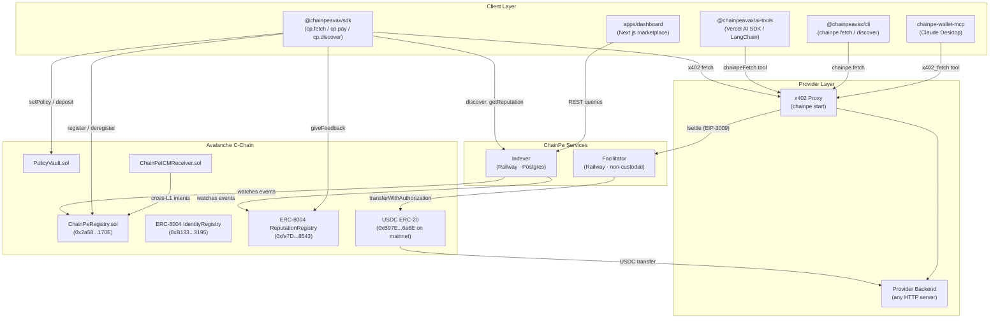
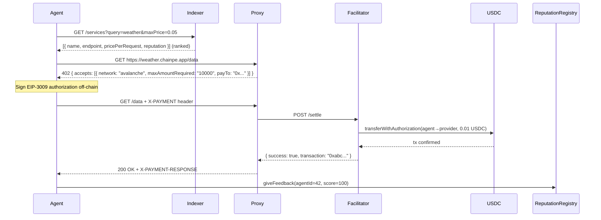

# Architecture Overview

ChainPe is infrastructure, not a single app. One payment + reputation core drives multiple surfaces. This page gives a high-level view of how everything fits together.

## System diagram

## Component responsibilities

### @chainpeavax/sdk

The primary consumer library. Wraps all x402 payment logic, ERC-8004 reputation, registry discovery, and PolicyVault interaction behind a clean TypeScript API. The `ChainPe` class is the entry point.

### @chainpeavax/ai-tools

Thin adapters that wrap SDK calls as Vercel AI SDK `tool()` objects or LangChain `StructuredTool` instances. Exposes `chainpeFetch` (pay for and call a URL) and `discoverService` (search and rank the registry).

### @chainpeavax/cli

Two roles in one package:
- **Provider**: `chainpe init/start/register` — configure and launch the x402 payment proxy
- **Consumer**: `chainpe fetch <url>` and `chainpe discover` — pay for APIs and browse the registry from the terminal

### chainpe-wallet-mcp

An MCP extension for Claude Desktop. Provides 9 tools: `x402_fetch`, `pay`, `search_bazaar`, `check_balance`, `give_feedback`, `spending_report`, `transfer_usdc`, `transfer_avax`, `request_funding`.

### x402 Proxy (chainpe start)

An Express server using the `x402-express` middleware. Gates every proxied request with a USDC payment. Two facilitator modes:
1. External: delegates to a configured facilitator URL
2. In-process: `chainpe start --facilitator <key>` runs a local facilitator

Exposes admin endpoints at `/chainpe-admin/stats`, `/chainpe-admin/payments`, `/chainpe-admin/config`, `/chainpe-admin/schema`.

### Facilitator

Implements the x402 facilitator HTTP contract: `POST /verify` and `POST /settle`. Non-custodial — the key only pays gas and relays the payer's already-signed `transferWithAuthorization`. Rate-limited to 60 req/min per IP. Prometheus metrics at `/metrics`.

### Indexer

Watches `ServiceRegistered`, `ServiceUpdated`, `ServiceDeregistered` events from `ChainPeRegistry` and reputation feedback events from `ReputationRegistry`. Stores results in Postgres. Serves a REST API for O(1) discovery and reputation queries.

### Avalanche C-Chain contracts

- `ChainPeRegistry`: the service marketplace. Keyed by `keccak256(developer, name)`.
- ERC-8004 registries: portable agent identity + reputation + validation
- `PolicyVault`: gasless, policy-bounded spending
- `ChainPeICMReceiver`: receives cross-L1 payment intents via Avalanche Teleporter

## Data flow: discovery → payment → reputation

## Trust boundaries

| Boundary | Trust assumption |
|---|---|
| Agent → Facilitator | Agent signs EIP-3009 with exact amount and recipient. Facilitator cannot redirect funds or steal more than signed. |
| Facilitator → USDC | Facilitator submits agent's signed message. USDC contract verifies the signature independently. |
| Agent → Registry | Registry is an immutable Solidity contract. Service data is what was registered on-chain. |
| Agent → Indexer | Indexer is an off-chain cache. Trust for discovery but verify on-chain for critical operations. |
| Owner → PolicyVault | PolicyVault enforces on-chain. No backend can override it. |
