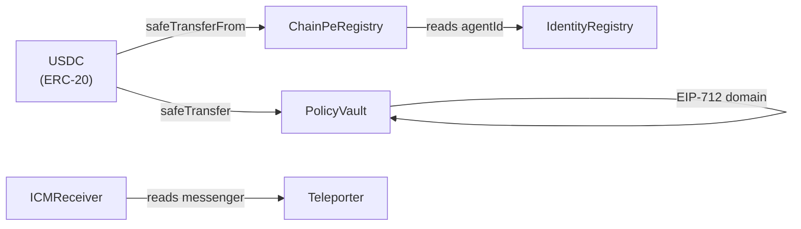

# Smart Contract Architecture

ChainPe's on-chain layer consists of five groups of contracts deployed on Avalanche C-Chain.

## Contract groups

### 1. ChainPeRegistry

The service marketplace. Providers register services; agents discover them.

- `ChainPeRegistry.sol` — non-upgradeable version for local dev/reference
- `ChainPeRegistryUpgradeable.sol` — UUPS-upgradeable version deployed on mainnet (behind ERC-1967 proxy)

**Inherits:** `Ownable2Step`, `ReentrancyGuard`, `Pausable`

**Key interactions:**
- Providers call `register(ServiceInput)` — requires USDC fee approval
- Agents call `getServices(offset, limit)` or read via events for discovery
- Owner calls `setRegistrationFee()`, `pause()`, `setIdentityRegistry()`

### 2. ERC-8004 Registries

Three UUPS-upgradeable registries for portable agent identity and reputation:

- `IdentityRegistryUpgradeable.sol` — ERC-721 NFT per agent
- `ReputationRegistryUpgradeable.sol` — scored feedback per agentId
- `ValidationRegistryUpgradeable.sol` — third-party attestations

**Key interactions:**
- Providers call `IdentityRegistry.register(agentURI)` to mint an identity
- Clients call `ReputationRegistry.giveFeedback(agentId, score, endpoint, tag)` after paid calls
- Anyone reads `ReputationRegistry` for discovery ranking

### 3. PolicyVault

Programmable, gasless spending policy.

- `PolicyVault.sol` — non-upgradeable
- `PolicyVaultUpgradeable.sol` — UUPS-upgradeable version for mainnet

**Inherits:** `EIP712`, `ReentrancyGuard`, `Ownable`, `Pausable`

**Key interactions:**
- Owners call `deposit()`, `setPolicy()`, `setAllowlist()`, `revokeSession()`
- Agents call `previewSpend()` (view) then sign EIP-712 off-chain
- Relayers call `spend()` with the agent's signature

### 4. ICM Contracts

Cross-L1 payment intents via Avalanche Teleporter:

- `ChainPeICMSender.sol` — source L1: sends payment intents
- `ChainPeICMReceiver.sol` — destination L1: receives and records intents
- `ITeleporter.sol` — interface to the Teleporter messenger

### 5. Mocks (testing only)

- `MockTeleporterMessenger.sol` — simulates ICM in Hardhat tests
- `MockUSDC.sol` — mintable ERC-20 for local testing

## Upgrade strategy

Local dev contracts are non-upgradeable for simplicity. Mainnet contracts use the UUPS pattern:

1. Deploy the implementation contract
2. Deploy `ERC1967Proxy(impl, initCalldata)`
3. All interactions go through the proxy address
4. Owner (multisig) can call `upgradeTo(newImpl)` on the proxy

The storage layout is documented in each contract and must not be reordered between upgrades (append-only).

## Contract interaction diagram

## Test coverage

44+ contract tests covering:

- `ChainPeRegistry`: register/update/deregister, fee collection, pagination, access control, pause/unpause
- `PolicyVault`: per-call cap, daily cap, total budget, expiry, allowlist, session revocation, nonce replay protection
- `ChainPeICMReceiver`: message delivery, trusted sender enforcement, intent storage
- ERC-8004: identity minting, reputation feedback, self-feedback blocking
- Upgradeable variants: initialization, UUPS upgrade authorization
