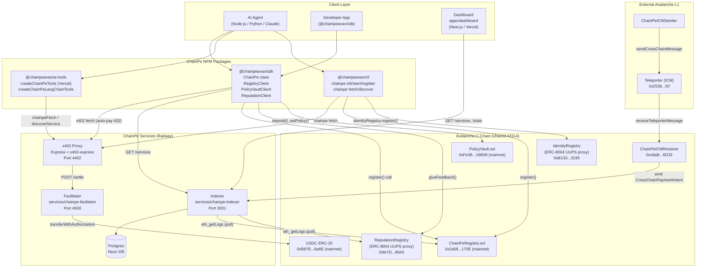

# System Diagram

Detailed component map of the ChainPe system, including data stores, external dependencies, and flow directions.



## Key data paths

### Happy-path payment (no PolicyVault)

```
Agent
  → cp.fetch(url)
  → GET url → 402 { accepts: [...] }
  → sign EIP-3009 authorization (off-chain, no gas)
  → GET url + X-PAYMENT
  → Proxy: POST /settle to Facilitator
  → Facilitator: USDC.transferWithAuthorization(agent→provider, amount)
  → Avalanche: confirm in ~1-2s
  → Facilitator: { success: true, transaction: "0x..." }
  → Proxy: forward to Backend → 200
  → Agent: receives PaidResult with txHash
```

### Happy-path payment (with PolicyVault)

```
Agent (session key)
  → PolicyVaultClient.signSpend(owner, to, amount)
  → returns SpendAuthorization { signature, nonce, deadline }

Relayer (facilitator or service)
  → PolicyVaultClient.relaySpend(auth)
  → PolicyVault.spend(owner, to, amount, deadline, sig)
  → [on-chain: verify sig, check all caps]
  → USDC.transfer(to, amount)
  → emit Spent(owner, to, amount, relayer, nonce)
```

### Discovery path (via indexer)

```
Agent
  → cp.discover({ query: "weather", maxPrice: "0.05" })
  → GET https://indexer/services?query=weather&maxPrice=0.05
  → Indexer: SQL query over cached service + feedback rows
  → Returns: ranked list of ServiceDto with reputation
```

### Discovery path (via on-chain read)

```
Agent
  → RegistryClient.listAllServices()
  → ChainPeRegistry.getServiceCount()
  → ChainPeRegistry.getServices(offset, 100) [paginated]
  → Returns: all active Service structs
  → SDK: rankByReputation() sorts by ERC-8004 score
```
