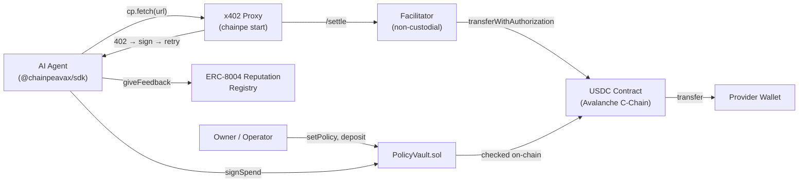

# Concepts

This section explains the core technical concepts behind ChainPe. Understanding these helps you reason about trust, security, and how each component relates to the others.

## x402 Protocol

The HTTP payment extension that ChainPe builds on. A server returns `402 Payment Required` with structured payment requirements; the client signs a USDC authorization and retries. [Read more](./x402-protocol.md)

## ERC-8004 Reputation

A proposed Ethereum standard for portable agent identity and reputation. ChainPe implements it so every paid call can build on-chain trust for providers. Self-feedback is blocked by the contract. [Read more](./erc-8004-reputation.md)

## Policy Vaults

The `PolicyVault.sol` contract lets owners set per-call caps, daily limits, total budgets, and allowlists for an agent's spending. The agent signs authorizations off-chain (gaslessly); a relayer submits them. The chain enforces every constraint. [Read more](./policy-vaults.md)

## ICM Cross-Chain

Avalanche Interchain Messaging (ICM / Teleporter) enables agents on one Avalanche L1 to hire services on another without bridges. `ChainPeICMReceiver` receives cross-subnet payment intents. [Read more](./icm-cross-chain.md)

## How the concepts connect

