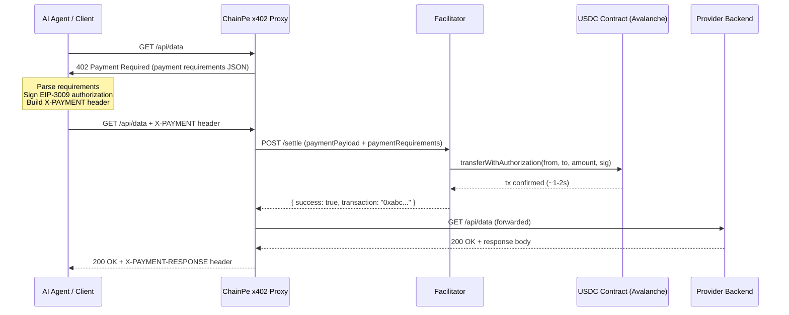

# x402 Protocol

x402 is an extension of HTTP that uses the long-reserved `402 Payment Required` status code to implement machine-native API payments. ChainPe implements x402 with USDC on Avalanche.

## History of HTTP 402

HTTP status code `402 Payment Required` was defined in RFC 2616 (HTTP/1.1, 1999) with the note "reserved for future use." The intent was always to enable per-request payments, but no standard was ever ratified — because the payment infrastructure did not exist. Blockchains and stablecoins changed that.

The x402 specification formalizes how `402` should be used: what the response body must contain, what header the client attaches on retry, and how a facilitator settles the payment on-chain.

## x402 request flow



## Payment requirements body

When an x402 endpoint receives an unauthenticated request, it returns:

```json
{
  "x402Version": 1,
  "accepts": [
    {
      "scheme": "exact",
      "network": "avalanche",
      "asset": "0xB97EF9Ef8734C71904D8002F8b6Bc66Dd9c48a6E",
      "maxAmountRequired": "10000",
      "payTo": "0xProviderWalletAddress",
      "resource": "https://api.example.com/api/data",
      "description": "Weather data per query"
    }
  ],
  "agentId": "42"
}
```

Key fields:
- `x402Version`: always `1` in the current ChainPe implementation
- `scheme`: `"exact"` means the exact stated amount must be transferred; no partial payments
- `network`: ChainPe uses `"avalanche"` for Avalanche C-Chain mainnet (or `"avalanche-fuji"` for testnet)
- `asset`: the USDC contract address on the target network
- `maxAmountRequired`: the price in atomic units (USDC has 6 decimals; `10000` = 0.01 USDC)
- `payTo`: the wallet address that receives the payment
- `agentId`: ChainPe extension — the provider's ERC-8004 agent id, for reputation feedback without a registry scan

## Payment header (X-PAYMENT)

The client selects a matching offer, signs a USDC EIP-3009 `transferWithAuthorization`, and attaches it as a base64-encoded header:

```
X-PAYMENT: eyJ4NDAyVmVyc2lvbiI6MSwic2NoZW1lIjoiZXhhY3QiLCJuZXR3b3JrIjoiYXZhbGFuY2hlIiwi...
```

The decoded structure contains:
```json
{
  "x402Version": 1,
  "scheme": "exact",
  "network": "avalanche",
  "payload": {
    "signature": "0x...",
    "authorization": {
      "from": "0xAgentWallet",
      "to": "0xProviderWallet",
      "value": "10000",
      "validAfter": "1718000000",
      "validBefore": "1718000300",
      "nonce": "0x...random bytes32..."
    }
  }
}
```

## Payment response header (X-PAYMENT-RESPONSE)

On successful settlement, the proxy attaches:

```
X-PAYMENT-RESPONSE: eyJzdWNjZXNzIjp0cnVlLCJ0cmFuc2FjdGlvbiI6IjB4YWJjLi4uIn0=
```

Decoded:
```json
{
  "success": true,
  "transaction": "0xabc123...",
  "network": "avalanche"
}
```

The SDK's `cp.pay()` method decodes this and surfaces it as `result.payment.txHash`.

## ChainPe extensions to x402

ChainPe adds two extensions on top of the base x402 spec:

### 1. Provider agentId advertisement

The `402` response body and the `X-CHAINPE-AGENT-ID` response header carry the provider's ERC-8004 `agentId`. This lets the SDK post reputation feedback after a successful payment without scanning the full registry to find which agent the payment went to.

### 2. Multi-network selection

The SDK's `ChainPe` class is constructed with a `network` parameter (`'avalanche'` for mainnet or `'avalanche-fuji'` for testnet). When multiple offers are present in the `accepts` array, the SDK selects only the offer matching its network. This enables providers to advertise on multiple networks simultaneously.

## How ChainPe implements x402

### Provider side: `@chainpeavax/cli`

The `chainpe start` command wraps your backend with an Express server using the `x402-express` middleware:

```ts
app.use(
  paymentMiddleware(
    config.walletAddress,    // where to receive payment
    routesConfig,            // { path, price, token } per route
    { url: facilitatorUrl }  // which facilitator to use for settlement
  )
)
```

The middleware intercepts all requests, returns `402` if no `X-PAYMENT` header is present, and calls the facilitator's `/settle` endpoint when one is present.

### Consumer side: `@chainpeavax/sdk`

`ChainPe.fetch()` manually runs the x402 flow: initial request → parse `402` body → sign → retry with `X-PAYMENT` → decode `X-PAYMENT-RESPONSE`. This gives the SDK full access to the payment metadata for surfacing in `PaidResult`.

## Supported networks

| x402 Network String | ChainPe Network | USDC Address | Notes |
|---|---|---|---|
| `avalanche` | `avalanche` | `0xB97EF9Ef8734C71904D8002F8b6Bc66Dd9c48a6E` | **Primary — Avalanche C-Chain mainnet** |
| `avalanche-fuji` | `avalanche-fuji` | `0x5425890298aed601595a70AB815c96711a31Bc65` | Testnet (development only) |
